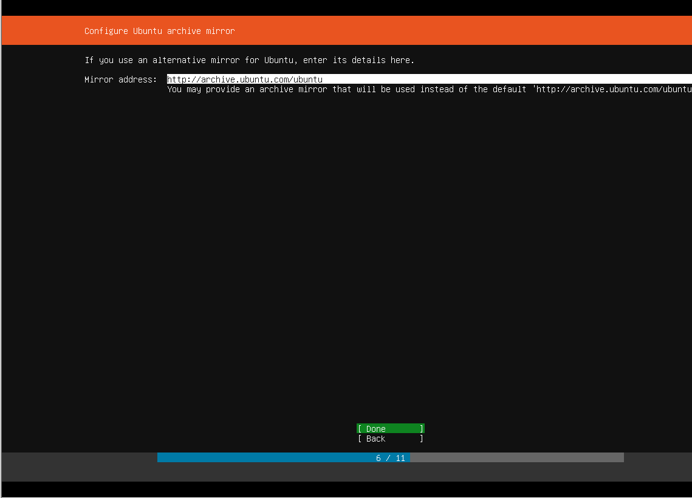

# Ubuntu server

## Ubuntu

Get Ubuntu from [http://releases.ubuntu.com/16.04/ubuntu-16.04.5-server-amd64.iso](http://releases.ubuntu.com/16.04/ubuntu-16.04.5-server-amd64.iso)

## **Install Ubuntu**

### VMware \(All\) / VirtualBox \(all - OSS\) / Hyper-V \(microsoft only\)

You can run Ubuntu by using one of the above virtualization software. Requirements are to be able to:

* install  a 64 bits operating system and 
* Use a disk at least of 500GB to 1TB.

#### VMware

Install VMware player \(Free\) or VMware Workstation Pro \(not Free\)

Start VMWare, and select "New virtual machine" or use CTRL-N





In terminal you may still have the wrong keyboard layout and timezone \(bug in vmware installer!?\), select the right keyboard by running again and the right timezone \(e.g. zurich\)

`sudo dpkg-reconfigure keyboard-configuration  
sudo dpkg-reconfigure tzdata`

## Bitcoind

#### Installation {#installation}

Get the latest release binary from [https://github.com/bitcoin/bitcoin/releases](https://github.com/bitcoin/bitcoin/releases) as of today the 0.17.0 at [https://bitcoincore.org/bin/bitcoin-core-0.17.0/bitcoin-0.17.0-x86\_64-linux-gnu.tar.gz](https://bitcoincore.org/bin/bitcoin-core-0.17.0/bitcoin-0.17.0-x86_64-linux-gnu.tar.gz)

```text
wget https://bitcoincore.org/bin/bitcoin-core-0.17.0/bitcoin-0.17.0-x86_64-linux-gnu.tar.gz
tar xvf bitcoin-0.17.0-x86_64-linux-gnu.tar.gz
```

#### Configuration {#configuration}

```text
mkdir ~/.bitcoin
```

Create a new file _~/.bitcoin/bitcoin.conf_ :

```text
vi ~/.bitcoin/bitcoin.conf
testnet=1
txindex=1
server=1
daemon=1
zmqpubrawblock=tcp://127.0.0.1:18501
zmqpubrawtx=tcp://127.0.0.1:18501
rpcuser=myLogin
rpcpassword=myPassword

ESC then :wq
```

#### Start Bitcoin and synchronize the blockchain {#lancement-et-synchronisation-de-la-blockchain}

```text
nohup ./bitcoind &
```

You can tail this file to check the status, be patient, as of today you'll need to synchronize a bit more than 220 GB

```text
tail -f ~/.bitcoin/testnet3/debug.log
```

You can also copy the state of another node by moving file from 

* _~/.bitcoin/testnet3/chainstate/_
* _~/.bitcoin/testnet3/blocks/_

### Lnd {#lnd}

#### Prerequisites {#prérequis}

Install Go and GIT

```text
sudo apt-get install golang-1.9 git
```

Update PATH :

```text
echo 'export GOPATH=~/gocode' >> $HOME/.profile
export GOPATH=~/gocode
echo 'export PATH=$PATH:$GOPATH/bin:/usr/lib/go-1.9/bin' >> $HOME/.profile
export PATH=$PATH:$GOPATH/bin:/usr/lib/go-1.9/bin
```

Install Glide, package Management for Golang [https://glide.sh](https://glide.sh/)

```text
go get -u github.com/Masterminds/glide
```

#### Installation {#installation-1}

```text
git clone https://github.com/lightningnetwork/lnd $GOPATH/src/github.com/lightningnetwork/lnd
cd $GOPATH/src/github.com/lightningnetwork/lnd
glide install
go install . ./cmd/...
```

#### Configuration {#configuration-1}

```text
mkdir ~/.lnd
```

Create a file _~/.lnd/lnd.conf_ :

```text
[Application Options]
debuglevel=info
debughtlc=true
maxpendingchannels=10
externalip=mon_ip_externe:9735
listen=localhost:9735
alias=mon node lightning

[Bitcoin]
bitcoin.active=1
bitcoin.node=bitcoind
bitcoin.testnet=1
```

LND automatically load files and config from `~/.bitcoin/bitcoin.conf`.

Ensure that port 9735 is accessible from the outside

#### Start LND {#lancement}

```text
lnd
```

**Create a new Wallet and define a secure password**

```text
lncli create
```

if you ever restart LND, you'll have to unlock the wallet with

```text
lncli unlock
```

**Generate a new Bitcoin address**

```text
lncli newaddress np2wkh
```

Keep this address safe, you wont see it again

**Transfer some testnet bitcoin using a faucet**

[https://testnet.manu.backend.hamburg/faucet](https://testnet.manu.backend.hamburg/faucet)

**Connect to another lightning node**

you can find potential node to connect to at [https://explorer.acinq.co](https://explorer.acinq.co/)

```text
lncli connect 03f113414ebdc6c1fb0f33c99cd5a1d09dd79e7fdf2468cf1fe1af6674361695d2@51.15.213.104:9735
```

#### Create a new channel {#création-dun-channel}

Open a channel and allocate 500000 satoshis au nouveau channel.

```text
lncli openchannel 02464bfaaae78b98268a6a6d7e8f6a110c60dd1293811d6029b11ee9edb4bbf869 --local_amt 500000
```

